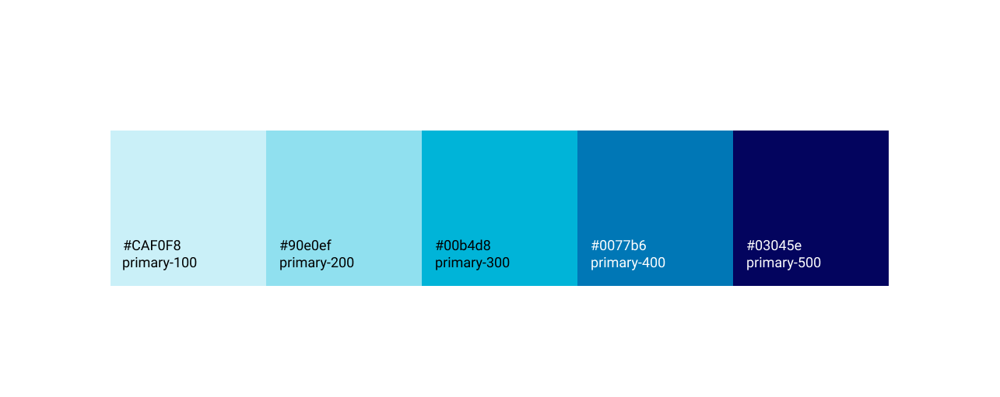
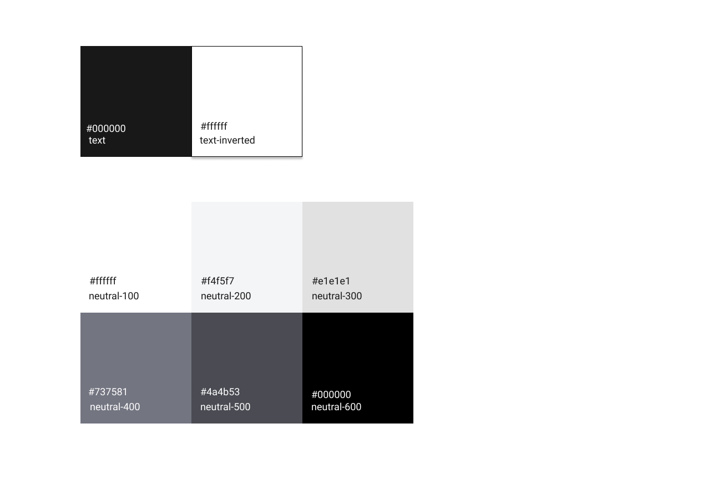
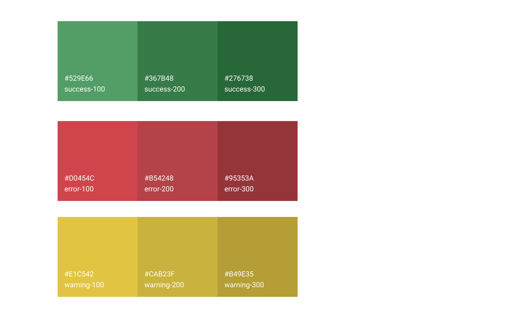
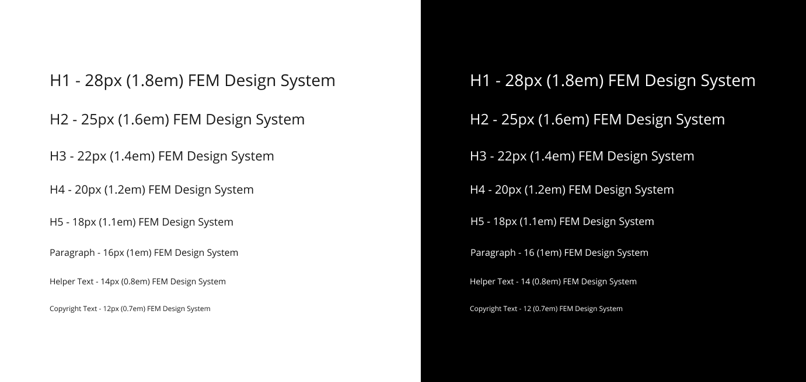
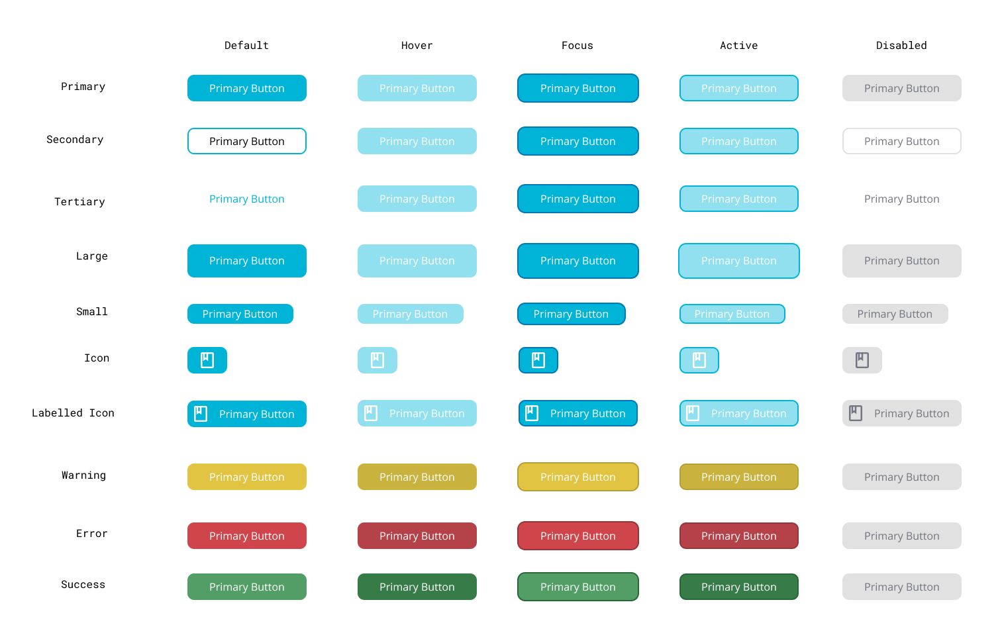
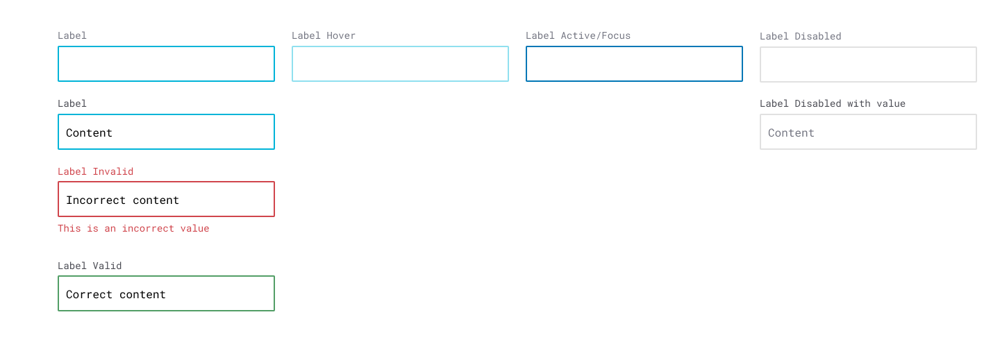
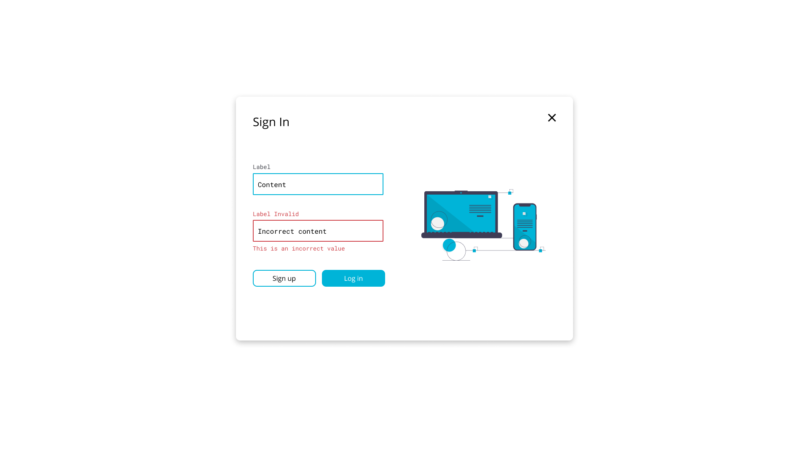

# design-system
My first attempts to create design system

## Color Palette

### Colors

### Neutrals

### Status Colors

---

## Typography

---

## Buttons

---

## Text Fields

---

## Modal Greeting

---

## Modal Login

